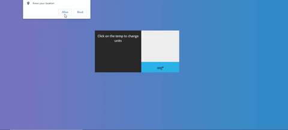

<h2>WeatherApp</h2>

This is a simple weather app coded in vanilla javascript. This app uses geolocation to retreive the local weather. Please select allow to get your local weather information.

<h4>Used technologies</h4>
<ul>
  <li>HTML</li>
  <li>CSS</li>
  <li>Bootstrap</li>
  <li>Vanilla JS</li>
  <li>jQuery</li>
</ul>

<h4>APIs</h4>
<ul>
  <li>OpenWeatherMap </li>
</ul>

